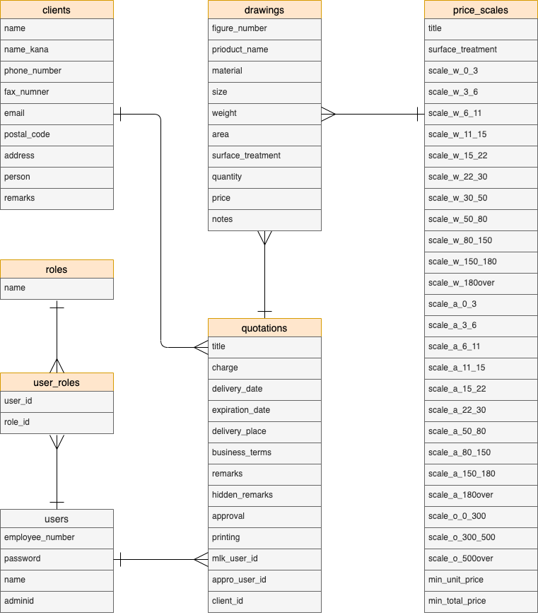
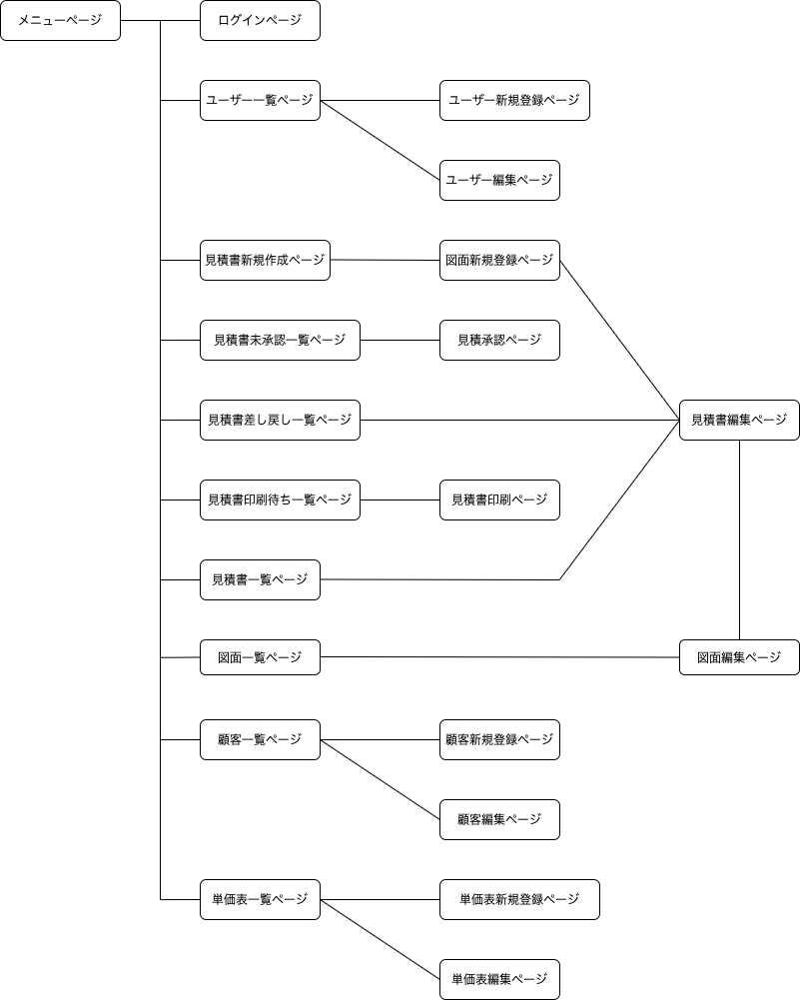

# アプリケーション名
見積作成アプリ

# アプリケーション概要
表面処理の見積を作成、保存することができる。  
そのために必要な情報を管理することができる。

# URL
https://quotation-app-37333.herokuapp.com/

# テスト用アカウント
- Basic認証ID:admin
- Basic認証password:pass1234
- 管理者ユーザーアカウント社員番号:0001
- 管理者ユーザーアカウントpassword:pass1234

# 利用方法
## 見積作成機能
1. ログイン後ルート画面(メニュー画面)から「見積新規作成」ボタンをクリックする。  
1. フォームに見積書の情報を入力し(タイトルと顧客は必須)を入力し「図面を追加する」ボタンをクリックする
1. 図面登録フォームにて情報を入力する。(図番、表面処理、単価、数量必須)  
立方体か円柱どちらかに寸法を入力すると、重量、面積、寸法が計算され、それに対応した計算基準が表示、単価が計算される。(選択した表面処理によっては全ては計算されない)  
重量、面積、寸法から計算された単価のうち一つを選択すると、その単価が最終単価に入力される。
数量を記入して次の図面を登録すると、ページ下部に登録された図面の情報が非同期で表示される。  
必要な図面の件数だけ連続で入力し、全ての図面が入力し終えたら「図面の登録を終了する」ボタンを選択する。  
1. 見積の情報入力フォームが再度表示されるため追加や変更がなければ「見積を保存」ボタンで見積を保存する。
## 見積承認機能
1. 新しく作成された見積は承認待ち状態にる。管理者ユーザーは見積を承認することができる。メニュー画面から「見積承認」ボタンをクリックする。  
1. 承認待ちの見積一覧が表示されるので、承認する見積を選択する。  
1. 見積編集画面が表示されるので、見積の修正がある場合はその場で修正できる。承認する場合は「承認」ボタンを、差し戻す場合は「差し戻し」ボタンをクリックする。
1. 承認された見積は見積印刷待ち状態へ、差し戻された見積は差し戻し修正待ち状態になるため、差し戻し一覧から必要事項を修正し、保存することで再度承認待ちにすることができる。
## 見積印刷機能
1. 承認された見積は印刷待ち状態となる。メニュー画面で「見積印刷」ボタンをクリックする。
1. 見積印刷待ち一覧が表示されるので印刷する見積を選択する。
1. 印刷用の見積書が表示されるため、ブラウザの印刷機能から見積書を印刷することができる。印刷画面が表示された時点で見積は印刷済み状態となり、見積一覧に追加される。
## ユーザー管理機能
1. メニュー画面から「ユーザー一覧」ボタンをクリックする。
1. ユーザー一覧が表示される。管理者ユーザーに限りここからユーザーの新規登録をおこなったり、編集、削除をすることができる。
## 顧客管理機能
1. メニュー画面から「顧客管理」ボタンをクリックする。
1. 顧客一覧が表示される。ふりがなの頭文字でタブで分類され、クリックすることで表示される。管理者ユーザーに限りここから新規登録、編集、削除を行うことができる。
## 単価表管理
1. メニュー画面から「単価表管理」ボタンをクリックする。
1. 単価表一覧が表示される。管理者ユーザーのみ新規登録、編集、削除をお請うことができる。ここで登録された単価表によって図面登録時の計算が行われる。

# アプリケーションを作成した背景
現職では図面に手書きで、電卓を使って見積計算を行なっている。その際見積実績がないかデータベースに図番で検索をかけて調べる。その後上司の承認を得た後、見積をデータベースに登録し、見積書を作成するが、その際にも図番を登録するため再度入力することになる。  
自動で見積を計算→承認→作成を行うことで、大幅に見積作業を効率化知ることができると考え、本アプリケーションを作成することにした。

# 洗い出した要件
https://docs.google.com/spreadsheets/d/1403ACxuIT4CN9isK8gLv208unnWEhzmTDPhgM0FRIN8/edit#gid=982722306

# 実装した機能についての画像やGIFおよびその説明

見積新規作成画面では必要事項を入力し、図面を追加するボタンをクリックすると、図面登録画面へ遷移する。

図面登録画面では寸法を入力すると、重量、面積、寸法が自動計算され、単価表を参照し、単価も自動計算される。そのうち一つを選択し、図面を追加することで、ページ下部に非同期で登録された図面の情報が表示される。

# 実装予定の機能
- インメリクリ検索
- 絞り込み、範囲指定、検索機能
- モーダルウィンドウ
- 2段階認証
- 図面添付
- 複数行の計算、合計機能
- 各ブラウザ対応デザイン
- フォームの動的なエラーメッセージ
- エラーメッセージの日本語化
- テーブルの行全体のリンク化
- ページネーション
- 見積書の日付を変更できるように
- ツールチップ
- 変更履歴
- 各ボタンにショートカットキーを割り当て

# データベース設計

# 画面遷移図

# 開発環境

HTML・CSS・Ruby・Ruby on Rails・JavaScript・GitHub・VisualStudioCode

# ローカルでの動作方法

以下のコマンドを順に実行  
% git clone https://github.com/bignyokki/quotation_system.git  
% cd quotation_system  
% bundle install
% yarn install

# 工夫したポイント

- 全体的なデザインとして、スクロールをできるだけ少なくし、一画面に全て情報がなるべく表示されるように意識した。
スクロールが必要な場合でもテーブル要素のみをスクロールさせ、各ボタンが隠れてしまわないようにした。  
- 見積作成の図面登録画面では、最小限の入力で自動で計算されるようjavascriptを組んだ。  
自動計算した内容は、変更が必要な場合は直接入力できるようにし、その入力内容で再計算されるようにした。  
また見積によっては何十件と図面を登録する必要があるため、非同期通信にてページ遷移をできるだけ少なくし、ストレスを減らせるようにした。
- ユーザー管理機能は、業務アプリの性質上、誰でも登録できるようにはしたくなかったので、deviseを改造し、管理者ユーザーがログインしたまま、他のユーザーを登録・編集・削除できるように変更した。また同時に、ログインIDをメールアドレスから社員番号に変更した。